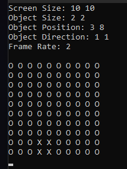

# Matrix-DVD-Bouncing

## Description
This is a very simple project made just for learning in the C language during the computer science course.

Be free to pull request and fork this project.

A C program that shows one matrix "Screen" within another matrix "Object" bouncing with the sides, similar to the old DVD players.
 
 

## Usage
You can easily choose between default values and custom values.

 
